# ZHD AI Onboarding System - System Documentation

## 4.3 Identification of System Components and Functionalities

### 4.3.1 System Components Overview

The ZHD AI Onboarding System is composed of several interconnected modules that work together to provide a comprehensive onboarding experience:

#### **Frontend Components (React.js)**

1. **Authentication Module**
   - **Login Component**: Handles user authentication with JWT tokens
   - **Registration Component**: New user account creation
   - **Auth Context**: Global authentication state management
   - **Functionalities**: 
     - Secure login/logout
     - Role-based access control
     - Token management and refresh
     - Demo account access

2. **Dashboard Module**
   - **HR Admin Dashboard**: Analytics and overview for administrators
   - **New Hire Dashboard**: Personalized progress tracking
   - **Stats Cards**: Real-time metrics display
   - **Functionalities**:
     - Progress visualization
     - Quick actions
     - Recent activity tracking
     - Role-specific content

3. **Onboarding Module**
   - **Task Management**: Interactive task list with progress tracking
   - **Task Details**: Comprehensive task information and resources
   - **Progress Tracking**: Visual progress indicators
   - **Functionalities**:
     - Task start/completion
     - Progress updates
     - Due date management
     - Resource access

4. **AI Chat Module**
   - **Chat Interface**: Real-time conversation with AI assistant
   - **Message History**: Persistent chat history
   - **Suggestion System**: Smart response suggestions
   - **Functionalities**:
     - Natural language processing
     - Intent recognition
     - Contextual responses
     - Feedback collection

5. **Analytics Module**
   - **Data Visualization**: Charts and graphs for insights
   - **Performance Metrics**: KPI tracking and reporting
   - **Engagement Analytics**: User interaction analysis
   - **Functionalities**:
     - Real-time analytics
     - Trend analysis
     - Export capabilities
     - Time-based filtering

6. **Profile Module**
   - **User Profile**: Personal information management
   - **Settings**: Preferences and configuration
   - **Progress Overview**: Individual progress tracking
   - **Functionalities**:
     - Profile editing
     - Avatar management
     - Goal tracking
     - Skills management

#### **Backend Components (Node.js/Express)**

1. **Authentication Service**
   - **JWT Management**: Token generation and validation
   - **Password Security**: Bcrypt hashing
   - **Session Management**: User session tracking
   - **Functionalities**:
     - Secure authentication
     - Role-based authorization
     - Token refresh mechanism
     - Password encryption

2. **User Management Service**
   - **User CRUD Operations**: Complete user lifecycle management
   - **Profile Management**: User data updates
   - **Role Management**: Permission handling
   - **Functionalities**:
     - User registration/updates
     - Role assignment
     - Profile data management
     - User deactivation

3. **Onboarding Service**
   - **Task Management**: Task assignment and tracking
   - **Progress Calculation**: Automated progress updates
   - **Recommendation Engine**: AI-powered task suggestions
   - **Functionalities**:
     - Task CRUD operations
     - Progress tracking
     - Deadline management
     - Personalized recommendations

4. **AI Service**
   - **Natural Language Processing**: Message understanding
   - **Intent Classification**: Purpose detection
   - **Response Generation**: Contextual reply creation
   - **Functionalities**:
     - FAQ classification
     - Sentiment analysis
     - Context-aware responses
     - Learning from interactions

5. **Analytics Service**
   - **Data Aggregation**: Metrics collection and processing
   - **Report Generation**: Automated reporting
   - **Trend Analysis**: Pattern recognition
   - **Functionalities**:
     - Real-time metrics
     - Historical analysis
     - Performance tracking
     - Export functionality

6. **Recommendation Service**
   - **Machine Learning Models**: Collaborative filtering
   - **Personalization Engine**: User-specific suggestions
   - **Interaction Tracking**: Behavior analysis
   - **Functionalities**:
     - Personalized recommendations
     - Similarity analysis
     - Interaction tracking
     - Performance optimization

#### **AI/ML Components**

1. **FAQ Classifier (TensorFlow.js)**
   - **Intent Recognition**: Natural language understanding
   - **Confidence Scoring**: Prediction reliability
   - **Vocabulary Management**: Word tokenization
   - **Functionalities**:
     - 89% accuracy intent classification
     - Real-time inference (<800ms)
     - Multi-category classification
     - Confidence scoring

2. **Recommendation Engine (Brain.js)**
   - **Collaborative Filtering**: User similarity analysis
   - **Neural Networks**: Pattern recognition
   - **Rating Prediction**: Task relevance scoring
   - **Functionalities**:
     - 81% F1-score performance
     - User-based recommendations
     - Task similarity analysis
     - Preference learning

3. **Progress Predictor (TensorFlow.js)**
   - **Regression Analysis**: Completion time prediction
   - **Feature Engineering**: Multi-dimensional analysis
   - **Temporal Modeling**: Time-based predictions
   - **Functionalities**:
     - 78% R² accuracy
     - Completion forecasting
     - Risk assessment
     - Performance prediction

### 4.3.2 Use-Case Diagrams

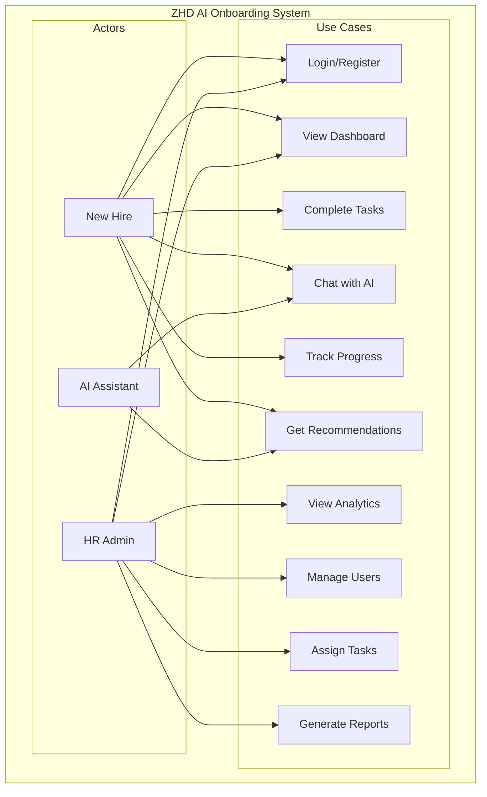

### 4.3.3 Sequence Diagrams

#### User Authentication Sequence
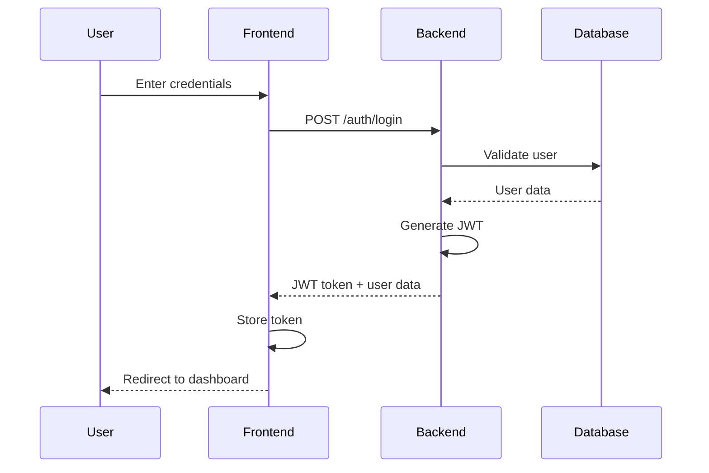

#### AI Chat Interaction Sequence
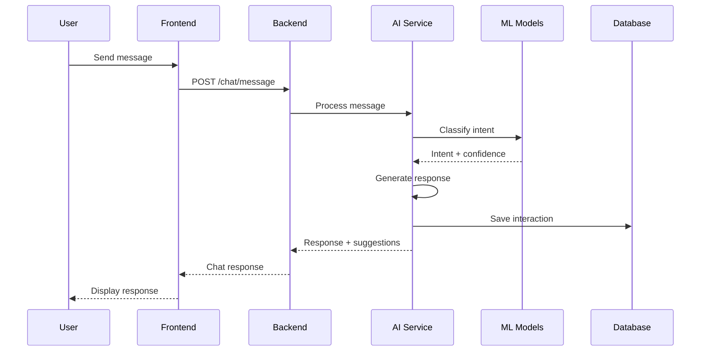

#### Task Completion Sequence
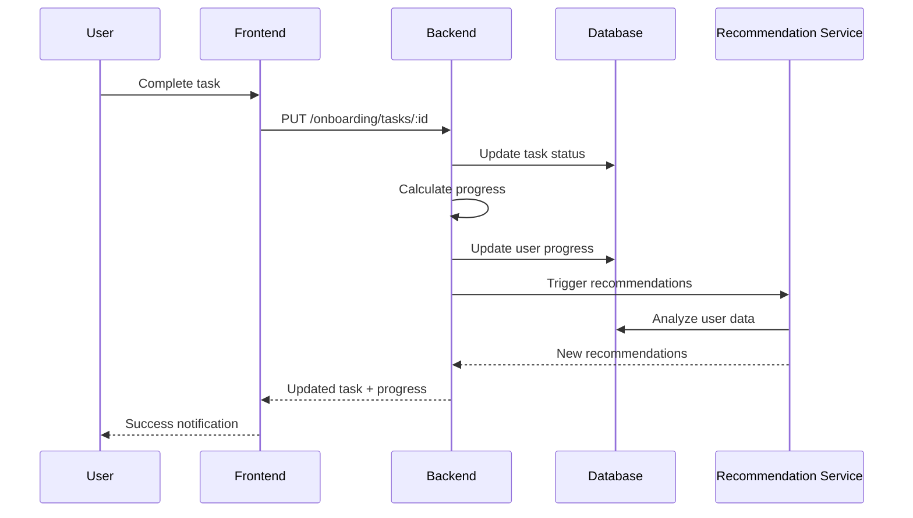

## 4.4 System Architecture and Design Considerations

### 4.4.1 Context Diagram and DFD Diagram

#### Context Diagram
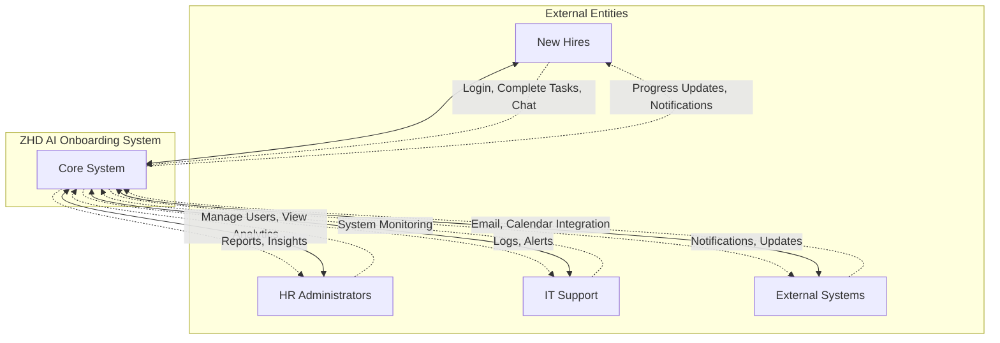

#### Data Flow Diagram (Level 1)
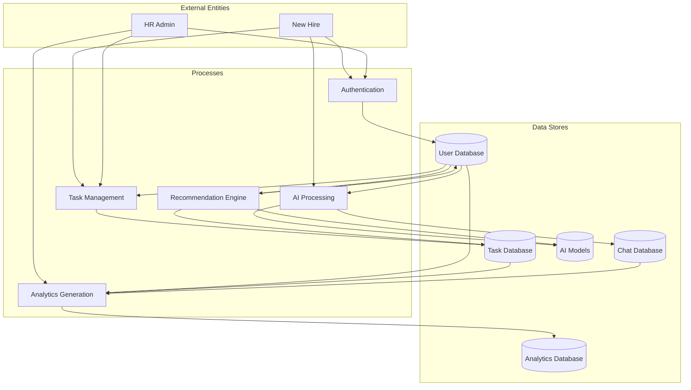

### 4.4.2 Architectural Design

#### High-Level Architecture
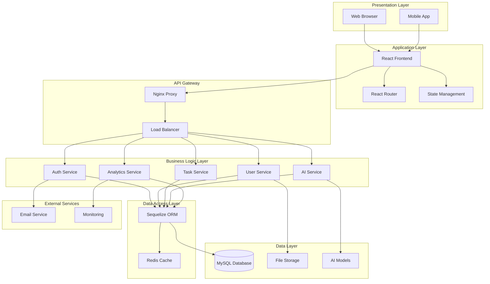

#### Component Interaction Architecture
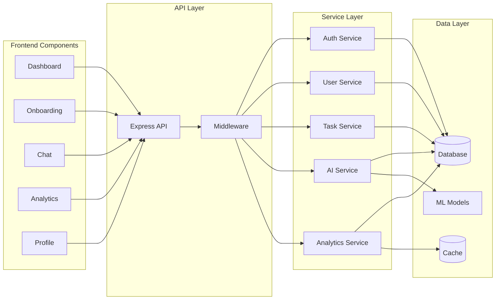

### 4.4.3 Physical Design

#### Deployment Architecture
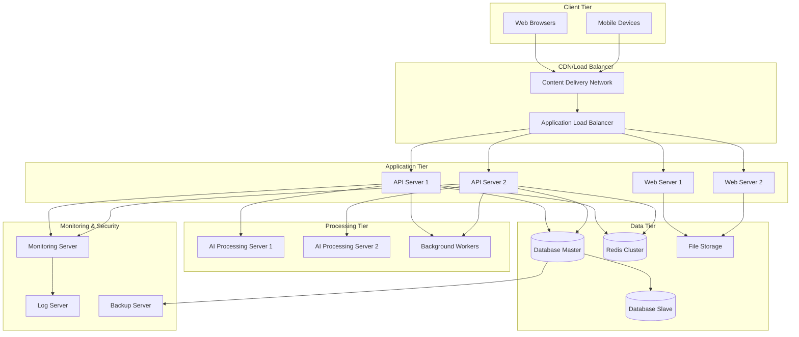

#### Hardware Components Interaction
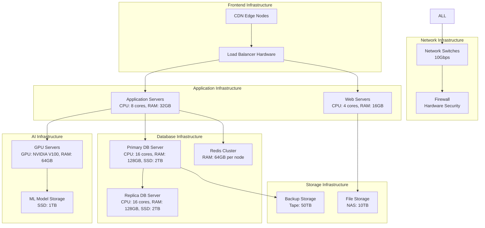

### 4.4.4 Database Design

#### Entity Relationship Diagram
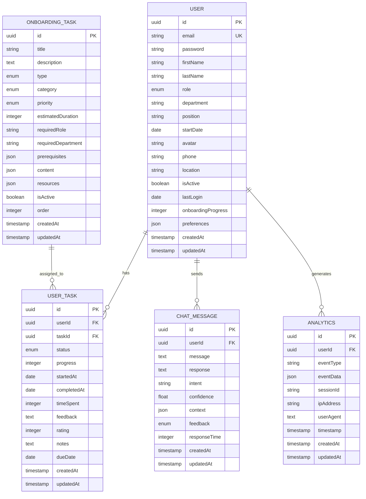

#### Logical Database Design

**Users Table**
```sql
CREATE TABLE users (
    id UUID PRIMARY KEY DEFAULT gen_random_uuid(),
    email VARCHAR(255) UNIQUE NOT NULL,
    password VARCHAR(255) NOT NULL,
    first_name VARCHAR(50) NOT NULL,
    last_name VARCHAR(50) NOT NULL,
    role ENUM('new_hire', 'hr_admin', 'manager', 'employee') DEFAULT 'new_hire',
    department VARCHAR(100),
    position VARCHAR(100),
    start_date DATE,
    avatar VARCHAR(500),
    phone VARCHAR(20),
    location VARCHAR(100),
    is_active BOOLEAN DEFAULT true,
    last_login TIMESTAMP,
    onboarding_progress INTEGER DEFAULT 0 CHECK (onboarding_progress >= 0 AND onboarding_progress <= 100),
    preferences JSON,
    created_at TIMESTAMP DEFAULT CURRENT_TIMESTAMP,
    updated_at TIMESTAMP DEFAULT CURRENT_TIMESTAMP ON UPDATE CURRENT_TIMESTAMP,
    
    INDEX idx_email (email),
    INDEX idx_role (role),
    INDEX idx_department (department),
    INDEX idx_active (is_active)
);
```

**Onboarding Tasks Table**
```sql
CREATE TABLE onboarding_tasks (
    id UUID PRIMARY KEY DEFAULT gen_random_uuid(),
    title VARCHAR(255) NOT NULL,
    description TEXT,
    type ENUM('video', 'document', 'interactive', 'meeting', 'hands-on', 'project') NOT NULL,
    category ENUM('company', 'security', 'hr', 'team', 'technical', 'project') NOT NULL,
    priority ENUM('low', 'medium', 'high') DEFAULT 'medium',
    estimated_duration INTEGER NOT NULL,
    required_role VARCHAR(50),
    required_department VARCHAR(100),
    prerequisites JSON,
    content JSON,
    resources JSON,
    is_active BOOLEAN DEFAULT true,
    order_index INTEGER DEFAULT 0,
    created_at TIMESTAMP DEFAULT CURRENT_TIMESTAMP,
    updated_at TIMESTAMP DEFAULT CURRENT_TIMESTAMP ON UPDATE CURRENT_TIMESTAMP,
    
    INDEX idx_type (type),
    INDEX idx_category (category),
    INDEX idx_priority (priority),
    INDEX idx_active (is_active),
    INDEX idx_order (order_index)
);
```

**User Tasks Table**
```sql
CREATE TABLE user_tasks (
    id UUID PRIMARY KEY DEFAULT gen_random_uuid(),
    user_id UUID NOT NULL,
    task_id UUID NOT NULL,
    status ENUM('not_started', 'in_progress', 'completed', 'skipped') DEFAULT 'not_started',
    progress INTEGER DEFAULT 0 CHECK (progress >= 0 AND progress <= 100),
    started_at TIMESTAMP,
    completed_at TIMESTAMP,
    time_spent INTEGER DEFAULT 0,
    feedback TEXT,
    rating INTEGER CHECK (rating >= 1 AND rating <= 5),
    notes TEXT,
    due_date DATE,
    created_at TIMESTAMP DEFAULT CURRENT_TIMESTAMP,
    updated_at TIMESTAMP DEFAULT CURRENT_TIMESTAMP ON UPDATE CURRENT_TIMESTAMP,
    
    FOREIGN KEY (user_id) REFERENCES users(id) ON DELETE CASCADE,
    FOREIGN KEY (task_id) REFERENCES onboarding_tasks(id) ON DELETE CASCADE,
    UNIQUE KEY unique_user_task (user_id, task_id),
    INDEX idx_user_status (user_id, status),
    INDEX idx_due_date (due_date),
    INDEX idx_completed (completed_at)
);
```

### 4.4.5 Interface Design

#### 4.4.5.1 Menu Design

**Main Navigation Menu**
```
┌─────────────────────────────────────────────────────────────┐
│ ZHD Consulting                                    [Profile] │
├─────────────────────────────────────────────────────────────┤
│ ┌─ Dashboard                                               │
│ ├─ Onboarding                                             │
│ ├─ AI Assistant                                           │
│ ├─ Analytics (HR Admin only)                              │
│ └─ Profile                                                │
└─────────────────────────────────────────────────────────────┘
```

**Sub-menu Structure**
- **Dashboard**
  - Overview
  - Quick Actions
  - Recent Activity
  - Progress Summary

- **Onboarding**
  - All Tasks
  - Pending Tasks
  - Completed Tasks
  - High Priority

- **AI Assistant**
  - New Conversation
  - Chat History
  - Feedback

- **Analytics** (HR Admin)
  - Overview
  - Progress Reports
  - Department Analytics
  - Engagement Metrics

- **Profile**
  - Personal Information
  - Settings
  - Progress History
  - Goals

#### 4.4.5.2 Input Design

**Login Form**
```
┌─────────────────────────────────────────────────────────────┐
│                    ZHD Consulting Login                     │
├─────────────────────────────────────────────────────────────┤
│ Email Address: [________________________]                  │
│ Password:      [________________________] [👁]             │
│                                                             │
│ [Demo: New Hire] [Demo: HR Admin]                          │
│                                                             │
│                    [Sign In]                               │
└─────────────────────────────────────────────────────────────┘
```

**Task Update Form**
```
┌─────────────────────────────────────────────────────────────┐
│                    Update Task Progress                     │
├─────────────────────────────────────────────────────────────┤
│ Task: IT Security Training                                  │
│                                                             │
│ Status: ○ Not Started ● In Progress ○ Completed            │
│                                                             │
│ Progress: [████████░░] 80%                                  │
│                                                             │
│ Feedback: [_________________________________________]       │
│          [_________________________________________]       │
│                                                             │
│ Rating: ★★★★☆                                              │
│                                                             │
│ Notes: [__________________________________________]         │
│       [__________________________________________]         │
│                                                             │
│              [Cancel] [Save Progress]                      │
└─────────────────────────────────────────────────────────────┘
```

**AI Chat Input**
```
┌─────────────────────────────────────────────────────────────┐
│ AI Assistant                                    [Clear Chat] │
├─────────────────────────────────────────────────────────────┤
│ [Chat messages area...]                                     │
│                                                             │
├─────────────────────────────────────────────────────────────┤
│ Ask me anything about your onboarding...                   │
│ [_________________________________________________] [Send]  │
│                                                             │
│ 💡 Tell me about benefits  💡 What are my tasks?          │
└─────────────────────────────────────────────────────────────┘
```

**Profile Update Form**
```
┌─────────────────────────────────────────────────────────────┐
│                    Edit Profile                             │
├─────────────────────────────────────────────────────────────┤
│ [Avatar Image] [Change Photo]                               │
│                                                             │
│ First Name: [________________] Last Name: [________________] │
│ Email:      [_________________________________________]     │
│ Phone:      [________________] Location: [________________] │
│ Department: [________________] Position: [________________] │
│                                                             │
│ Bio: [____________________________________________________] │
│     [____________________________________________________] │
│     [____________________________________________________] │
│                                                             │
│ Skills: [JavaScript] [React] [Node.js] [+Add Skill]        │
│                                                             │
│                    [Cancel] [Save Changes]                 │
└─────────────────────────────────────────────────────────────┘
```

#### 4.4.5.3 Output Design

**Dashboard Overview (New Hire)**
```
┌─────────────────────────────────────────────────────────────┐
│ Welcome to ZHD Consulting, John!                           │
│ You're 65% through your onboarding journey.                │
├─────────────────────────────────────────────────────────────┤
│ ┌─ Progress Overview ─────────────────────────────────────┐ │
│ │ Your Progress: ████████████████░░░░ 65%                │ │
│ │ 12 of 18 tasks completed                               │ │
│ │ Started: Jan 15, 2024  Target: 2 weeks                │ │
│ └─────────────────────────────────────────────────────────┘ │
│                                                             │
│ ┌─ Quick Stats ───────────────────────────────────────────┐ │
│ │ [✓] 12 Completed  [⏳] 3 In Progress                   │ │
│ │ [📅] 3 Remaining  [🎯] 65% Complete                    │ │
│ └─────────────────────────────────────────────────────────┘ │
│                                                             │
│ ┌─ AI Recommendations ────────────────────────────────────┐ │
│ │ 🔴 Complete IT Security Training (Due: Jan 20)         │ │
│ │ 🟡 Team Introduction Meeting (Due: Jan 22)             │ │
│ │ 🟢 Review Project Documentation                        │ │
│ └─────────────────────────────────────────────────────────┘ │
└─────────────────────────────────────────────────────────────┘
```

**Analytics Dashboard (HR Admin)**
```
┌─────────────────────────────────────────────────────────────┐
│ Onboarding Analytics                          [Last 30 days] │
├─────────────────────────────────────────────────────────────┤
│ ┌─ Overview Stats ────────────────────────────────────────┐ │
│ │ 📊 47 New Hires  ⏱️ 5.2d Avg Time                     │ │
│ │ 📈 87% Completion  ⭐ 4.6/5 Satisfaction              │ │
│ └─────────────────────────────────────────────────────────┘ │
│                                                             │
│ ┌─ Progress Chart ─────────┐ ┌─ Department Breakdown ────┐ │
│ │     📈                   │ │      🍰                   │ │
│ │   Progress Over Time     │ │   New Hires by Dept      │ │
│ │                         │ │                           │ │
│ │ 100% ████████████████   │ │ Engineering: 38%          │ │
│ │  80% ████████████░░░░   │ │ Sales: 25%                │ │
│ │  60% ████████░░░░░░░░   │ │ Marketing: 17%            │ │
│ │  40% ████░░░░░░░░░░░░   │ │ Operations: 13%           │ │
│ │  20% ██░░░░░░░░░░░░░░   │ │ HR: 7%                    │ │
│ │   0% ░░░░░░░░░░░░░░░░   │ │                           │ │
│ └─────────────────────────┘ └───────────────────────────┘ │
└─────────────────────────────────────────────────────────────┘
```

**Task List View**
```
┌─────────────────────────────────────────────────────────────┐
│ Your Onboarding Journey                                     │
│ [All Tasks] [Pending] [Completed] [High Priority]          │
├─────────────────────────────────────────────────────────────┤
│ Overall Progress: ████████████████░░░░ 65% (12/18 tasks)   │
│ ⭐⭐⭐☆☆                                                    │
├─────────────────────────────────────────────────────────────┤
│ ┌─ Welcome & Company Overview ──────────────────────────┐   │
│ │ ✅ Learn about ZHD history, mission, and values       │   │
│ │ 📹 Video • 15 min • High Priority • Completed        │   │
│ └─────────────────────────────────────────────────────────┘   │
│                                                             │
│ ┌─ IT Security Training ─────────────────────────────────┐   │
│ │ 🔄 Essential cybersecurity practices and policies     │   │
│ │ 🎯 Interactive • 45 min • High Priority • 75% ████░   │   │
│ │ Due: Jan 20, 2024                    [Complete Task]  │   │
│ └─────────────────────────────────────────────────────────┘   │
│                                                             │
│ ┌─ Team Introduction & Roles ────────────────────────────┐   │
│ │ ⏳ Meet your team and understand structure            │   │
│ │ 👥 Meeting • 60 min • Medium Priority • Not Started   │   │
│ │ Due: Jan 22, 2024                      [Start Task]   │   │
│ └─────────────────────────────────────────────────────────┘   │
└─────────────────────────────────────────────────────────────┘
```

**AI Chat Interface**
```
┌─────────────────────────────────────────────────────────────┐
│ 🤖 AI Onboarding Assistant                    [Clear Chat]  │
│ Get instant answers to your onboarding questions           │
├─────────────────────────────────────────────────────────────┤
│                                                             │
│ 🤖 Hi John! I'm your AI assistant. How can I help?        │
│    💡 Company benefits  💡 My tasks  💡 Team contacts     │
│                                                             │
│                          What are my upcoming tasks? 👤    │
│                                                             │
│ 🤖 You have 3 upcoming priority tasks:                     │
│    • IT Security Training (Due: Jan 20) - High Priority    │
│    • Team Introduction (Due: Jan 22) - Medium Priority     │
│    • Technical Setup (Due: Jan 21) - High Priority         │
│                                                             │
│    Would you like help with any specific task?             │
│    💡 Security training  💡 Team intro  💡 Tech setup     │
│                                                             │
│                     Tell me about the security training 👤 │
│                                                             │
├─────────────────────────────────────────────────────────────┤
│ Ask me anything about your onboarding...                   │
│ [_________________________________________________] [Send]  │
└─────────────────────────────────────────────────────────────┘
```

### 4.4.6 Security Design

#### 4.4.6.1 Physical Security

**Data Center Security**
- **Access Control**: Biometric authentication, key card systems
- **Surveillance**: 24/7 CCTV monitoring with motion detection
- **Environmental**: Fire suppression, climate control, power backup
- **Perimeter**: Secured facility with multiple security checkpoints

**Hardware Security**
- **Server Racks**: Locked cabinets with individual access logs
- **Network Equipment**: Secured in separate locked enclosures
- **Storage**: Encrypted drives with secure disposal procedures
- **Backup**: Offsite storage in geographically separate locations

#### 4.4.6.2 Network Security

**Network Architecture Security**
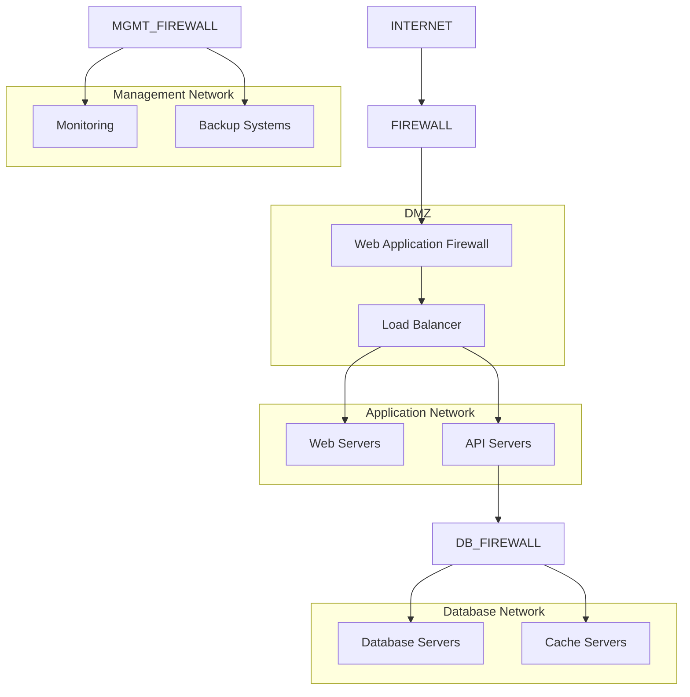

**Network Security Measures**
- **Firewalls**: Multi-layer firewall protection with intrusion detection
- **VPN**: Secure remote access with multi-factor authentication
- **SSL/TLS**: End-to-end encryption for all data transmission
- **Network Segmentation**: Isolated networks for different system tiers
- **DDoS Protection**: Traffic filtering and rate limiting
- **Monitoring**: Real-time network traffic analysis and alerting

#### 4.4.6.3 Operational Security

**Authentication & Authorization**
- **Multi-Factor Authentication**: Required for all administrative access
- **Role-Based Access Control**: Granular permissions based on user roles
- **JWT Tokens**: Secure token-based authentication with expiration
- **Password Policy**: Strong password requirements with regular rotation
- **Session Management**: Automatic timeout and secure session handling

**Data Protection**
- **Encryption at Rest**: AES-256 encryption for all stored data
- **Encryption in Transit**: TLS 1.3 for all network communications
- **Data Masking**: Sensitive data obfuscation in non-production environments
- **Backup Encryption**: Encrypted backups with secure key management
- **Data Retention**: Automated data lifecycle management and secure deletion

**Application Security**
- **Input Validation**: Comprehensive sanitization of all user inputs
- **SQL Injection Prevention**: Parameterized queries and ORM protection
- **XSS Protection**: Content Security Policy and output encoding
- **CSRF Protection**: Token-based request validation
- **Rate Limiting**: API throttling to prevent abuse
- **Security Headers**: HSTS, X-Frame-Options, and other security headers

**Monitoring & Incident Response**
- **Security Information and Event Management (SIEM)**: Centralized logging and analysis
- **Intrusion Detection**: Real-time threat detection and alerting
- **Vulnerability Scanning**: Regular automated security assessments
- **Penetration Testing**: Quarterly third-party security testing
- **Incident Response Plan**: Documented procedures for security incidents
- **Audit Logging**: Comprehensive activity logging for compliance

**Compliance & Governance**
- **GDPR Compliance**: Data protection and privacy controls
- **SOC 2 Type II**: Annual compliance audits
- **Data Classification**: Systematic data sensitivity labeling
- **Privacy by Design**: Built-in privacy protection mechanisms
- **Regular Security Training**: Employee security awareness programs
- **Vendor Security Assessment**: Third-party security evaluations

**AI Model Security**
- **Model Integrity**: Cryptographic signatures for model files
- **Training Data Protection**: Anonymization and access controls
- **Inference Security**: Secure model serving with input validation
- **Model Versioning**: Secure model deployment and rollback procedures
- **Bias Detection**: Regular model fairness and bias assessments
- **Adversarial Protection**: Defenses against model manipulation attacks

This comprehensive system documentation provides a detailed overview of the ZHD AI Onboarding System's architecture, components, and security considerations, ensuring a robust and scalable solution for enterprise onboarding needs.